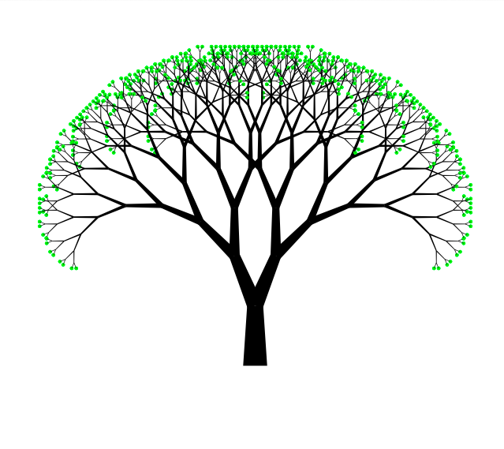

# Task 1. Traffic lights.
Implementation of an animation of traffic lights for cars, pedestrians and cyclists.

These lights go through a period of four states: \
• green light active (go, 3 seconds) \
• yellow light active (complete maneuver, 1 second) \
• red light active (stop, 3 seconds) \
• red and yellow lights active (ready, 1 second) 

# Task 2. Fractal tree.
Implement a fractal tree drawing.

