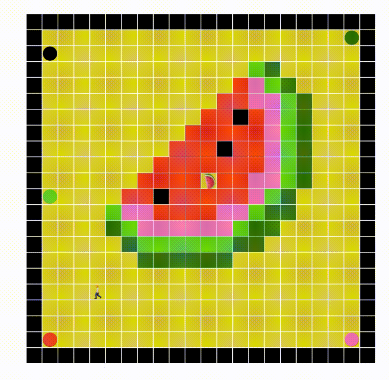
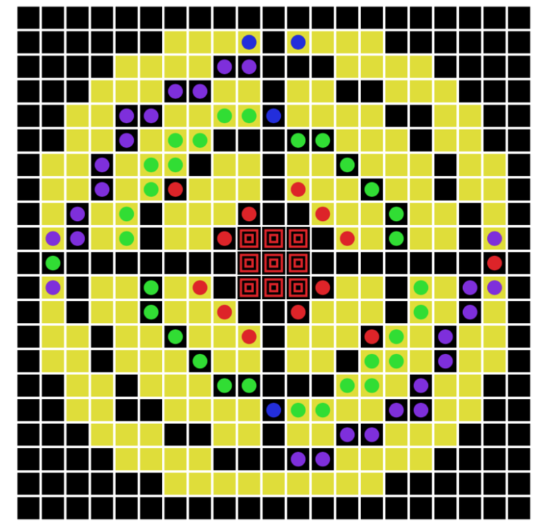

# Task 1. Escape the room
Implementation a playable escape the room game with one level.
Implementation details: \
- Make character to only be able to walk over Floor, Button and Exit tiles. \ 
- Open the doors of specific color when character steps on button of this color. \

Sample level

