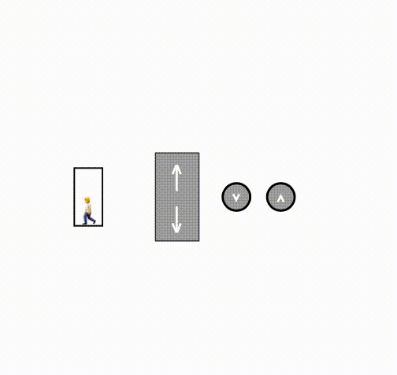

# Task 1. Simple Elevator

Implementation of simple elevator based on finite state machine (FSM) model.

We will be using three buttons for our simple elevator: \ 
• «Go Up» button will make the elevator go up (Top arrow on keyboard) \
• «Go Down» button will make the elevator go down (Bottom arrow key on keyboard) \
• «STOP» button will halt elevator (SPACE key on keyboard).

