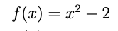
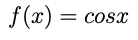

# Task 1. Newton’s algorithm.
Implementation of Newton's root-finding algorithm that finds an approximation of a solution (root) to an equation

```
root
  :: Fractional a
  => Int -- ˆ Maximum number of iterations.
-> (a -> Bool) -- ˆ An acceptable error (precision).
-> (a->a) -- ˆ Function f to find zero for.
-> (a->a) -- ˆ Derivative f' of function f.
-> a -- ˆ Initial guess.
-> Maybe (Int, a) -- ˆ Number of iterations and root
                  -- (where function is zero), if found.

```

```
>>> root 100 (< 1e-7) (\x -> xˆ2 - 2) (\x -> 2*x) 123
Just (10,1.41421356237384)
```


```
>>> root 100 (< 1e-12) cos (negate . sin) 1.0
Just (3,1.5707963267954879) 
```