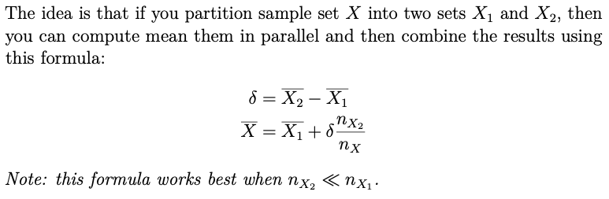
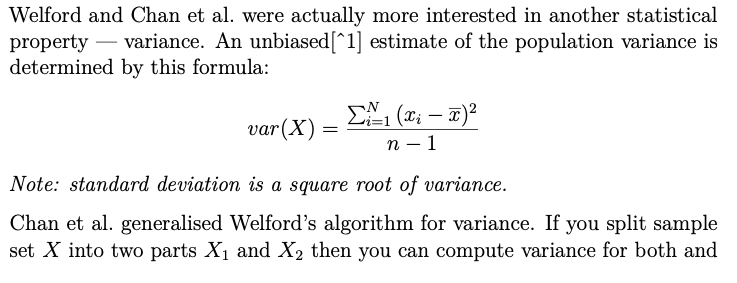
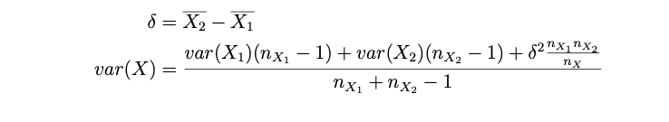

# Task 1. Statistics.
## 1.1 Parallel Mean
Implementation of Welford algorithm for online mean computation.



```
-- | A mean with a number of values this mean was computed for.
data Mean a = Mean Int a deriving (Show)
```
Examples:

```
>>> mean [2, 7, 9]
Mean 3 6.0
```

## 1.2 Parallel Variance

 \


```
-- | Indermediate results for
-- count, mean and variance.
data Variance a = Variance Int a a
```
Examples:

```
>>> variance [1, 3, 5]
Variance 3 3.0 4.0
```